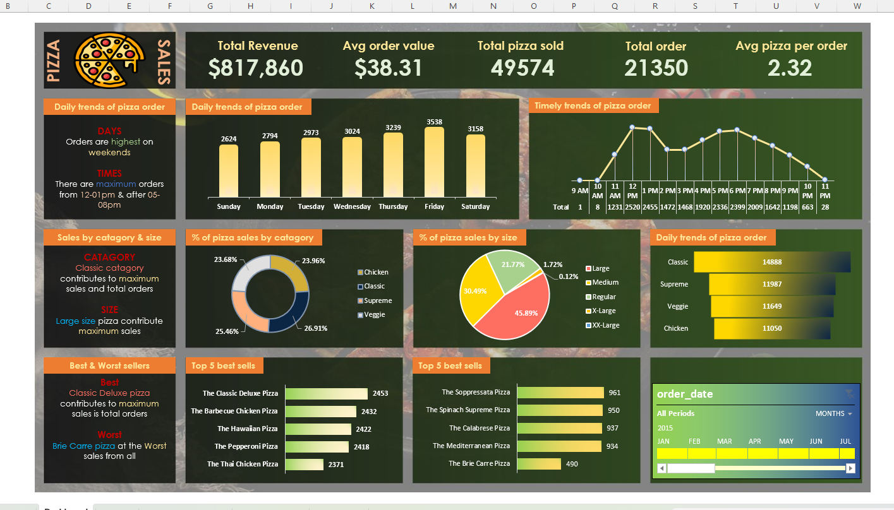

# 📊 Data Analytics Portfolio

Welcome to my Data Analytics Portfolio!  
I specialize in turning raw data into actionable insights through **SQL, Python, Tableau, and Excel**.  
This portfolio showcases projects that highlight my ability to clean, analyze, visualize, and forecast data for both academic research and business decision-making.

---

## 👤 About Me

I am a Data Analyst specializing in business intelligence and time-series forecasting. 
I combine technical expertise with analytical storytelling to transform complex datasets into strategic insights that support data-driven decision-making.  

- 🎯 **Career Goal:** To leverage data-driven strategies that improve efficiency, identify opportunities, and deliver measurable business outcomes.  
- 💼 **Freelance Focus:** Helping businesses unlock the value of their data with tailored analytics solutions.  

---

## 🛠️ Skills

- **Programming & Data Analysis:** Python (pandas, NumPy, scikit-learn, statsmodels), SQL  
- **Visualization & BI Tools:** Tableau, Excel  
- **Analytics Expertise:** Forecasting, KPI tracking, Data Cleaning, Business Intelligence  
- **Soft Skills:** Clear communication, problem-solving, client-focused approach  

---

## 📂 Projects

### 🔮 Energy Transition Forecasting
- **Focus:** Comparative study of statistical and AI-based time-series models for energy demand forecasting
- **Techniques:** Regression models, ML forecasting, model evaluation (MAE, RMSE)
- **Impact:** Supported long-term energy transition planning through predictive analytics  

---

### 📈 Sales Performance Dashboard
- **Tools:** Tableau  
- **Focus:** Interactive dashboards for sales and customer analytics  
- **Impact:** Designed interactive dashboards tracking 10+ KPIs with year-over-year and weekly trend analysis

[View Project](https://public.tableau.com/views/SalesCustomerDashboard_17724009711310/SalesDashboard?:language=en-US&:sid=&:redirect=auth&:display_count=n&:origin=viz_share_link) 

---

### 🏢 Layoffs Data Analysis
- **Tools:** SQL  
- **Focus:** Data cleaning and exploratory analysis of layoffs dataset  
- **Impact:** Analyzed multi-year layoff data to identify sector-level employment trends and economic patterns  

---

### 🍕 Pizza Sales Dashboard
- **Tools:** Microsoft Excel  
- **Focus:** Business performance monitoring for a pizza shop  
- **Impact:** Highlighted top-selling products, leading to improved promotional targeting and sales growth

---

## 💼 Services Offered

I provide tailored analytics solutions for businesses and individuals:

- **Data Cleaning & Preparation** – Transform messy datasets into reliable formats  
- **Dashboard Development (Tableau & Excel)** – Build interactive dashboards for KPI tracking and decision-making  
- **Business Performance Analysis** – Identify growth opportunities and optimize operations  
- **Forecasting & Predictive Modeling (Python)** – Anticipate future trends with statistical and ML techniques  
- **Custom Analytics Solutions** – Tailored approaches to unique business problems  

**Why Work With Me?**  
- Clear communication and client-focused approach  
- Proven ability to deliver actionable insights, not just charts  
- Flexible engagement — from one-time projects to ongoing analytics support  

---

## 📬 Contact

- 📄 [Download My Resume](resume.pdf)  
- 📧 Email: adnan.abdulkhaleque@gmail.com  
- 🌐 Portfolio: [adnan-bin-abdul-khaleque.github.io/my-resume](https://adnan-bin-abdul-khaleque.github.io/my-resume)  

---

## 🚀 Next Steps

- Recruiters: Explore my projects and download my resume.  
- Freelance Clients: Reach out to discuss how I can help solve your data challenges.  

---

⭐ **Tip:** If you find this portfolio valuable, feel free to connect or collaborate!
